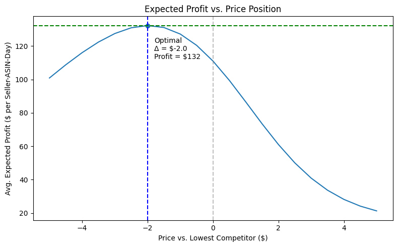
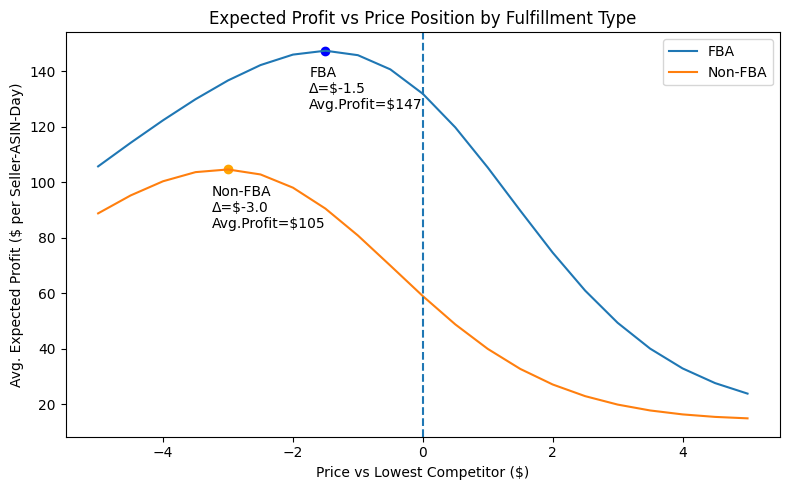

# Amazon Buy Box Pricing Strategy (Causal + Optimization)

A data science project that models Buy Box dynamics and identifies profit-maximizing pricing strategies using causal inference and simulation.

---

## Business Problem

Amazon sellers often assume they must offer the lowest price to win the Buy Box. However, lower prices reduce margins and may not maximize profit.

This project evaluates how pricing impacts Buy Box outcomes and identifies the optimal price relative to competitors.  

---


> **TL;DR:** Optimal pricing is not the lowest price. Sellers maximize profit by pricing slightly below competitors (~$2), achieving ~82% Buy Box win rate and ~$130 daily profit per listing.    

---
 
## Key Results

- Sellers with the lowest price win the Buy Box ~63% of the time (naive estimate)
- After adjusting for confounders, price remains the dominant driver of Buy Box outcomes
- Optimal pricing occurs **slightly below the lowest competitor (~$2)**
- At this point:
  - ~82% Buy Box win probability
  - ~$7 contribution margin per unit
  - ~$130 expected profit per listing per day




### Operational Insight

- FBA sellers have ~13 percentage point higher Buy Box probability at price parity
- This allows FBA sellers to price less aggressively than non-FBA sellers  




---  

## Approach

The analysis follows a structured decision science framework:

1. **Marketplace Exploration**
   - Analyze Buy Box dynamics and competitive structure

2. **Descriptive Modeling**
   - Logistic regression to identify key drivers of Buy Box outcomes

3. **Causal Inference**
   - Regression adjustment, IPW, and AIPW to isolate the effect of pricing

4. **Simulation & Optimization**
   - Simulate pricing scenarios to identify the profit-maximizing price position  

---  

## Project Structure

- `notebooks/01–07` → end-to-end analysis
- `src/` → data generation and modeling logic
- `data/synthetic/` → simulated marketplace data
- `reports/figures/` → key visualizations  

---  

## How to Run

```bash
pip install -r requirements.txt  

Run Notebook 01 to Notebook 07  
```  
---
## Final Takeaway

Winning the Buy Box is not simply about being the cheapest.

The optimal strategy is to price slightly below competitors to balance conversion and margin. Operational advantages such as FBA further shift this balance by reducing the need to compete on price.

---  

## Author

Scott Belarmino  
Data Scientist | Decision Science | Causal Inference  

---

## Notes

This project was independently developed as part of a data science portfolio.  

Large Language Models (LLMs) were used to assist with code organization, documentation clarity, and readability. All modeling, analysis, and interpretations were designed and validated by the author.